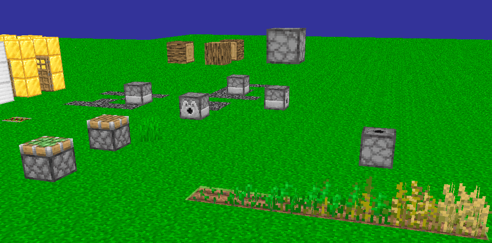
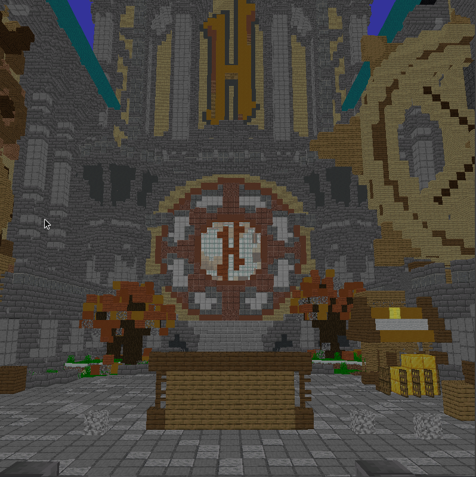
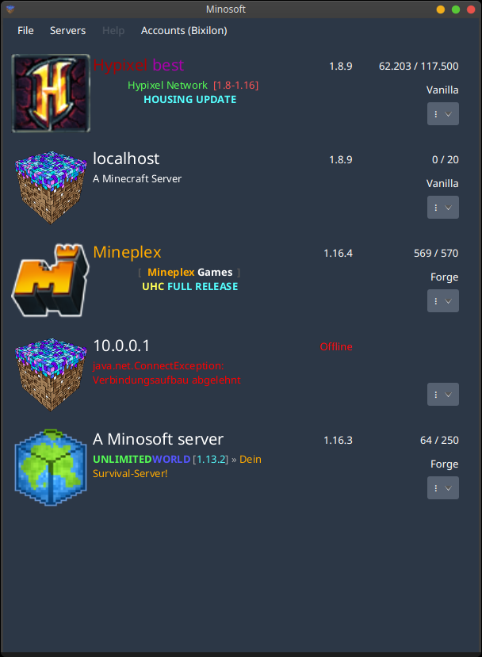

# Minosoft
Minosoft is an open source minecraft client, written from scratch in java. It aims to bring more functionality and stability.

 

## Feature overview
 - Rendering (WIP)
 - Multi protocol support (1.7 - latest)
 - Modding
 - Fast performance (incredible start time of 3 - 5 seconds on modern hardware (tested on Intel i7-4800MQ)
 - Free (as far as we consider original minecraft as free) and open source
 - Multi accounting
 - Multi "sessions" (Connections to a server)
 - Multi threading
 - Async loading
 - Debugging on protocol layer
 - Search for LAN Server

## System requirements
 - CPU: Minosoft benefits from multiple cores (at least for most stuff). CPU is kind of important,
  but for the rendering clock speed is more important. 4 cores recommended with at least 2 Ghz.
 - RAM: Out goal was it to run without compromises on an 8 Gib computer and at least limited on an 4 Gib one.
 - Disk space: Minosoft itself is pretty small (2-3 Mib), the libraries are a bit bigger (up to 100 MB).
  You also need to have the "normal" minecraft assets (~ 300 MB). So a total of 500 MB is recommended.
 - GPU: Currently only needed for rendering, no clue yet.
 - Java 15 (This is really important, we use specific (experimental) features that are only available in the latest version. Java 8 is **not** supported).
 OpenJDK is (of course) also supported.

## Rendering
Rendering is developed and maintained by Lukas Eisenhauer. It is very WIP, but it works. See !8 for more details.

  
The current result of rendering (taken in 739f861bf62341698abcd58386c353a4831f4818).

  
The Hypixel prototype lobby (taken in 91ab431004fa1ae132a1eb1115550f84c27f48f8).

## Launcher
The "Launcher" is not really a launcher, it is just a (beautifully designed, but functional) server list with account management functionality.
Launcher is in quotation marks, because it is not really a launcher. It is the game. You click on run and see this window. All downloads, loadings, ... happen before it asynchronous in the background.
If you double-click on the server. you can connect to it. Once connected (= Received spawn location), you can play :)

## Version support
I always try to add support for the newest version of minecraft. Mostly it is pretty easy, just add the newest version to the `versions.json` and generate the mappings.
After pushing it, it is supported. Some versions are more complicated and need a bit of coding. I always try it as fast as possible, but sometimes I just need time.
Check out [wiki.vg](https://wiki.vg/Main_Page) for more information.

### Supported versions
Almost all versions are supported, starting with 13w41b (pre 1.7 snapshot) and ending with the newest (1.16.4 as of writing this). I plan to maintain Minosoft to at least version 1.20, so stay tuned. 

### Unsupported versions
Sadly, we cannot support all versions. We will add support for all major versions (like 1.8.9, 1.9.4, 1.14.4, etc), but it is simply not possible to support all snapshots.
 - `1.13-pre6`, `1.13-pre5`, `17w50a`, `17w49b`, `17w49a`, `17w48a`, `17w47b`, `17w47a` Missing blocks.json (Mappings)
 - April fools: I will not add any support for them, there are only a few things known. They might work, untested.
 
### Partly supported versions
 - Protocol lacking; See [snapSupportToDo.txt](/doc/snapSupportToDo.txt)
 - Entities everything below `19w36a` (shortly after 1.14.4) (except `1.14.4` and `1.8.9`). Why? There is simply no time to generate an `entities.json`. The [Generator](/util) only works after that version.
And 1.8.9 is only supported, because this version is widely spread, and I wrote (~ 1000 lines) by hand.

## Modding
Minosoft is modding friendly. I am working hard on a reasonable API. See !17 for more details. See [Modding.md](doc/Modding.md) for more details. The code is pretty dynamic (all blocks, items, entities, etc are stored in json files). It is pretty easy to load custom entities, etc.
We will add a real modding API once Rendering is complete. Spoiler: Forge mods are NOT compatible. Feel free to write a compatibility layer (This is a really hard thing, we do things completely different).

## Botting
On the ToDo List

## Contribution or helping out
You're welcome. Because this is still work-in-progress, consider contacting us first, but feel free to take a look at [Contribution.md](/Contribution.md).

## Tools and generators
We wrote some tools to help out, see [Utility](util/ReadMe.md).

## Credits
Some projects and persons helped this project a lot. See [Credits](Credits.md).

## Releases and beta
No clue, but still waiting for !8. Also, some features need to be implemented, so not soo soon (but we are getting closer).

## Compiling and running
1. Install Maven and java 15 (On Ubuntu based distributions: `sudo apt install maven openjdk-15-jdk`).
2. Clone this repo (`git clone https://gitlab.bixilon.de/bixilon/minosoft.git`).
3. Change directory (`cd minosoft`).
4. Checkout the branch (`git checkout <branch>`). Eventually `render` or `development`.
5. Build and run Minosoft with `mvn clean verify exec:java`. If any errors occur, feel free to open an issue. In this early stage it might be helpful
 to delete the app data folder (only of minosoft).

This readme is work in progress, things may change over time.
